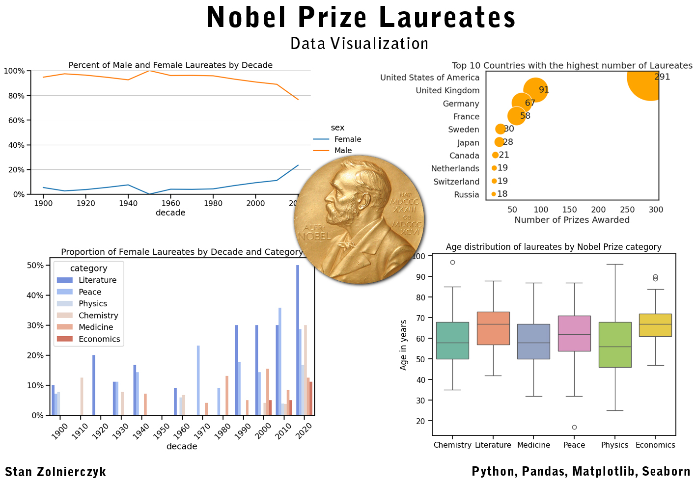
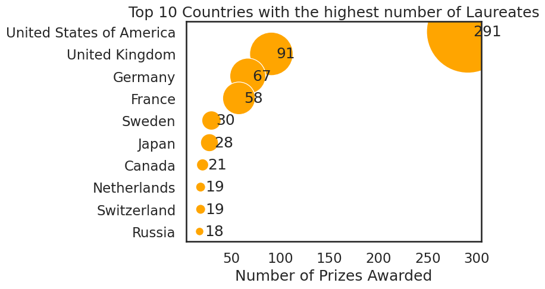
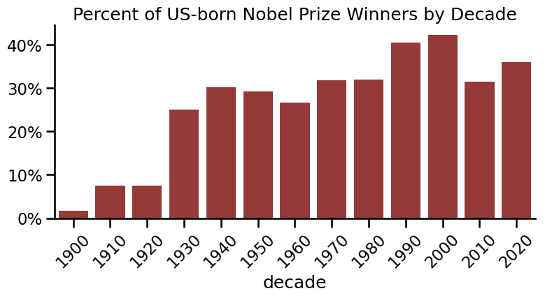
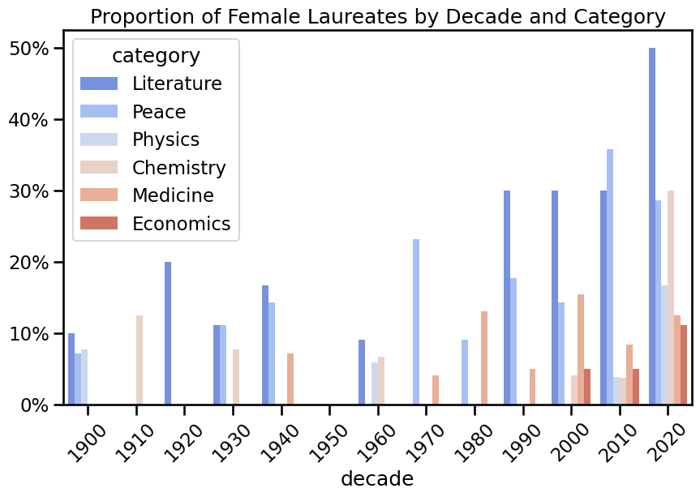
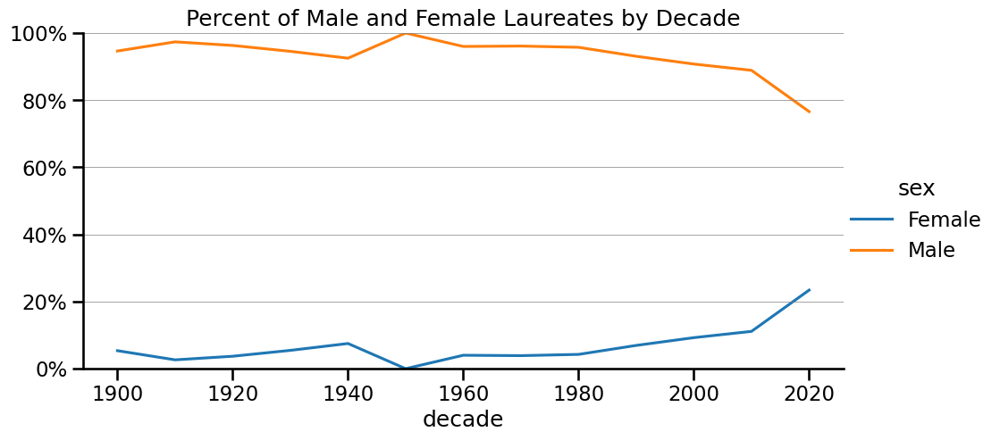
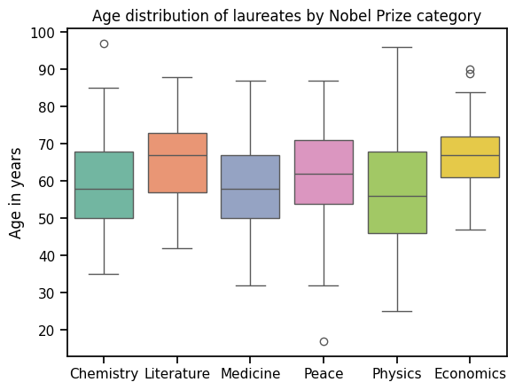
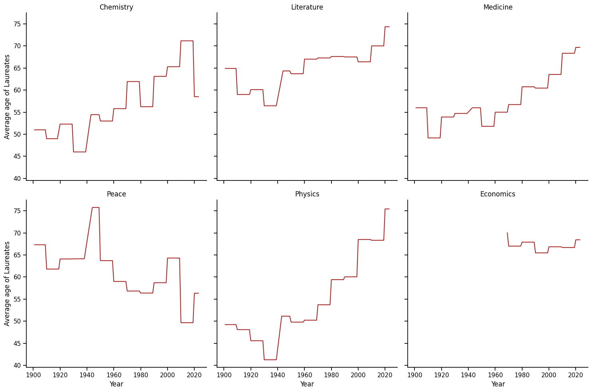
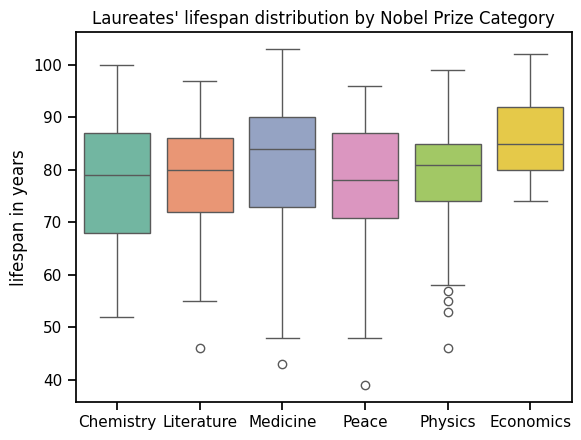

Data analysis doesn't have to be boring, one chart can quickly show many interesting insights and trends. Using the Nobel Prize winners' dataset as an example, I would like to show what interesting analyses can be performed and what conclusions can be drawn from them.
In this article I would like to focus on data visualization, showing the various possibilities offered by the Seaborn library available in Python.

NOTE: Full Python code for data manipulation and plots used in this article is in nobel_prize_winners.ipynb available in git repository.

# 1. What are the Top 10 most commonly awarded Laureates' countries of birth?

The result is not a surprize. A deeper analysis would most likely show a strong correlation between the number of Nobel Prizes awarded and a country's GDP and research spending. (The number of Nobel Prizes awarded does not necessarily correlate with the total population.)

# 2. Which decade had the highest ratio of US-born Nobel Prize winners to total winners in all categories?

Conclusions: Consistent with p.1. USA was not a very rich country until the 1920s, but became one in the 1930s and began to invest heavily in sicentific research. It remains so until today, with a slight upward trend.

# 3. Which decade had the highest proportion of female laureates? Is there a trend?

Analysis of this graph shows that the overall proportion of female winners is increasing over the years. There is also one sad observation: in the 1950s there were no female winners in any category.

To better measure the proportion of the total number of female winners to all winners, a line graph will be used on the transformed data

Conclusions: There has been a steady and consistent increase in the number of female laureates since the 1950s, with the largest increase occurring in the 2000s (although the dataset for this decade is not complete)

# 4. Correlation between Categories and age of laureates

Which category has the oldest average laureate? And which has the youngest?

Conclusions:

1. Laureates in the field of physics are statistically the youngest. However, this field also has the widest range of results.
2. Laureatest with the highest average age are in the fields of Literature and Economics. However, in the case of economics, the awards have only been granted since the 1970s
3. The above analysis covers a period of over 120 years, so the results may not reflect the latest current trends. For more accurate results, a deeper analysis should be carried out, taking into account changes over the years.

Note: To create the above plot, standard parameters for IQRs and Whiskers for seaborn boxplot have been used (more details about boxplots are available in my other article)

# 5. Age change of Laureates over time

Are laureates getting younger or older over time?

Conclusions:

1. In general, the Laureates are getting older. The most dramatic example is in the field of Physics. The only counterexample is the Nobel Peace Prize. For economics, values ​​are quite constant.

2. The above results may result from the fact that in some fields (e.g. Physics) due to the very large number of important discoveries, scientists are often awarded the prize several (or more) years after the publication of their works.

# 6. Bonus Section: What is the average lifespan of laureates by category?

Does the profession of a scientist guarantee a long life? :-)

Based on this particular data, the the answer is: average life expectancy of laureates is around 80 years, with the highest in the field of Economics.
However, the analysis did not answer the question of whether being a Nobel Prize-winning scientist makes you live longer than the average for the general population. To get a satisfactory answer to this question, the results would have to be compared with data for the general population, divided by year and country of birth.

# Summary

Tools currently available through standard Python libraries (Pandas, Numpy, Matplotlib) allow for fast and efficient data analysis, and the Seaborn library enables rapid and diverse visualizations with flexible customization options. Data analysis results become accessible and understandable for practically everyone.
Flexibility and customizable styles make data analysis visually appealing and deliver the necessary information and conclusions in the most convenient way.
